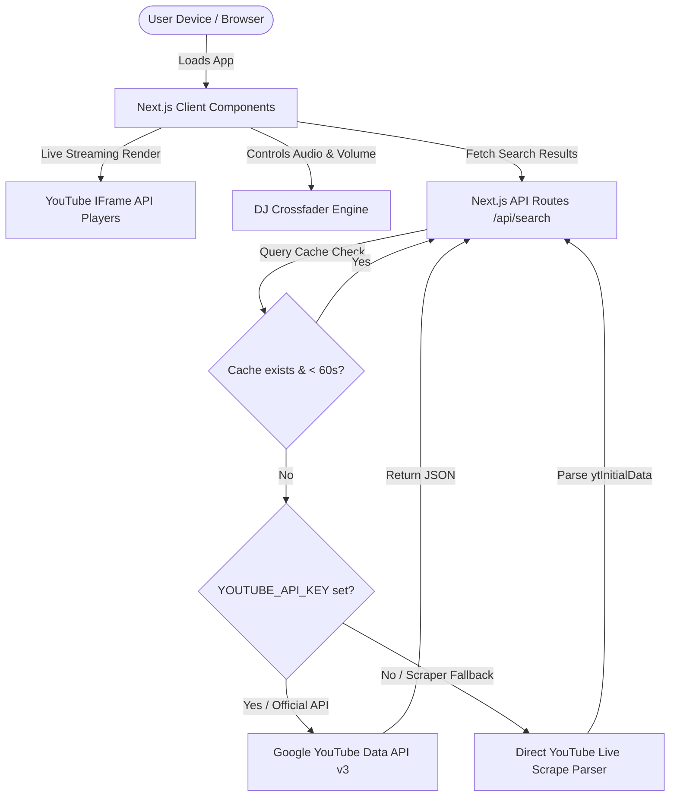

# 🎧 DoubleWatch - Multi-Screen YouTube Live Stream Mixer

DoubleWatch is an open-source, high-performance web application designed for synchronized multi-screen YouTube Live streaming. Built on Next.js 15, React, TypeScript, and customized styling (IBM Plex Mono theme), it delivers a premium "DJ Mixer" experience for video streams. It features a custom volume crossfader, frosted glass overlays, layout configuration presets (1 to 4 streams), live chat overlays, and a live stream search panel.

---

## 📐 Architecture Topology

Here is the structural design of the DoubleWatch application:



### Key Components:
1. **Next.js Client UI:** Runs React client-side logic to handle layout grids, states, local storage preferences, and custom volume transitions.
2. **YouTube Player Engine:** Uses optimized HTML5 IFrames to stream YouTube Live content with custom playback wrappers.
3. **DJ Crossfader Engine:** Dynamically calculates volume ratios (`CH 1` vs `CH 2`) based on the crossfader slider's input, adjusting individual player volumes via YouTube's iframe postMessage hooks.
4. **Hybrid Search API Route (`/api/search`):** A dual-method search engine that runs securely on the backend, handling API calls or scraping to avoid CORS blocks.

---

## 🔒 YouTube API & Environment Variables

DoubleWatch is open source and runs completely serverless. It features a **hybrid search system**:
- **Official Mode:** If you provide your own official Google Cloud YouTube Data API v3 key, it will use official Google quota-controlled queries to retrieve streams and active concurrent viewer stats.
- **Scraper Mode (Zero-Config Fallback):** If no environment variables are defined, the application automatically triggers a fallback scraper that parses public search results, making the repository work instantly out-of-the-box without keys.

### Setting Up Your Environment
To use your own API credentials, copy the environment template to your local environment file:

```bash
cp .env.example .env.local
```

Open `.env.local` and paste your Google API key:

```env
YOUTUBE_API_KEY=your_google_cloud_youtube_api_key_here
```

---

## ✨ Features

- **Multi-Screen Layouts:** Toggle seamlessly between 1, 2, 3, or 4 layout panes to watch multiple live streams simultaneously.
- **Volume Crossfader (2-Channel DJ Mode):** Fade audio smoothly between Channel 1 and Channel 2, or mix them at custom percentages.
- **Instant Live Search:** Automatically loads recommended live streams upon opening, featuring viewer-count badges and "Live" status markers.
- **Live Chat Overlays:** Pop out and toggle individual chat feeds for each active player.
- **IBM Plex Mono Typography:** Beautiful, retro-futuristic monospaced interface styling.
- **Frosted Glass UI/UX:** Stunning, high-fidelity dark visual scheme optimized for mobile and desktop screens.
- **Automatic Hydration Suppression:** Suppresses ad-blocker or extension-induced hydration errors on launch.

---

## 🚀 Getting Started

### Prerequisites
- Node.js (v18.x or later)
- npm or yarn

### Installation

1. Clone the repository:
   ```bash
   git clone https://github.com/yourusername/doublewatch.git
   cd doublewatch
   ```

2. Install dependencies:
   ```bash
   npm install
   ```

3. Run the development server:
   ```bash
   npm run dev
   ```
   Open [http://localhost:3000](http://localhost:3000) (or 3001) in your browser.

4. Build for production:
   ```bash
   npm run build
   npm run start
   ```

---

## 📄 License

This project is licensed under the MIT License. Feel free to copy, modify, distribute, and build upon it.
