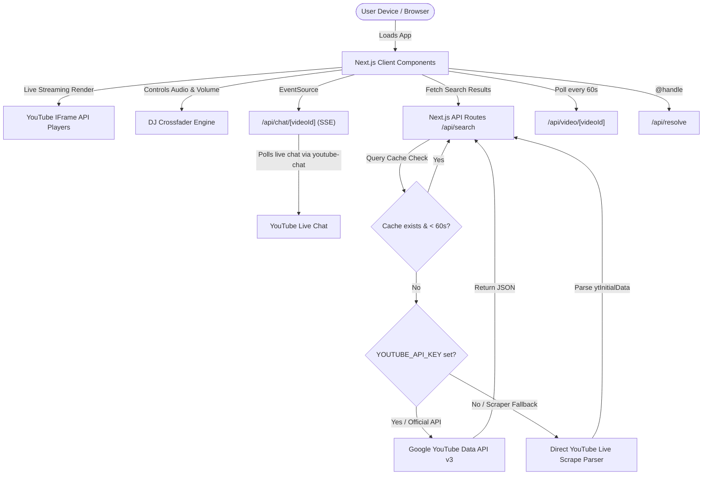

# 🎧 DoubleWatch - Multi-Screen YouTube Live Stream Mixer

DoubleWatch is an open-source web app for watching 2–4 YouTube live streams side by side with DJ-style audio control. Built on Next.js 16, React and TypeScript with a lightweight dark UI in a tako.id-inspired palette (Nunito, slate-teal surfaces, blue accents, tactile "key" buttons). It features a crossfader and per-channel mixer, grid and spotlight layouts, live chat (a side panel per screen, or merged across channels), a library of presets, history and followed channels, shareable links, and an installable PWA.

---

## 📐 Architecture Topology

Here is the structural design of the DoubleWatch application:


```mermaid
graph TD
  User([User Device / Browser]) -->|Loads App| NextClient[Next.js Client Components]
  NextClient -->|Live Streaming Render| YouTubeEmbed[YouTube IFrame API Players]
  NextClient -->|Controls Audio & Volume| AudioMixer[DJ Crossfader Engine]
  NextClient -->|Fetch Search Results| NextAPI[Next.js API Routes /api/search]
  NextClient -->|EventSource| ChatAPI["/api/chat/[videoId] (SSE)"]
  ChatAPI -->|Polls live chat via youtube-chat| YTChat[YouTube Live Chat]
  NextClient -->|Poll every 60s| VideoAPI["/api/video/[videoId]"]
  NextClient -->|"@handle"| ResolveAPI["/api/resolve"]
  
  NextAPI -->|Query Cache Check| CacheCheck{Cache exists & < 60s?}
  CacheCheck -->|Yes| NextAPI
  CacheCheck -->|No| YTFetch{YOUTUBE_API_KEY set?}
  
  YTFetch -->|Yes / Official API| YTDataAPI[Google YouTube Data API v3]
  YTFetch -->|No / Scraper Fallback| YTScrape[Direct YouTube Live Scrape Parser]
  
  YTDataAPI -->|Return JSON| NextAPI
  YTScrape -->|Parse ytInitialData| NextAPI
```

### Key Components:
1. **Next.js Client UI:** Runs React client-side logic to handle layout grids, states, local storage preferences, and custom volume transitions.
2. **YouTube Player Engine:** Uses optimized HTML5 IFrames to stream YouTube Live content with custom playback wrappers.
3. **DJ Crossfader Engine:** Dynamically calculates volume ratios (`CH 1` vs `CH 2`) based on the crossfader slider's input, adjusting individual player volumes via YouTube's iframe postMessage hooks.
4. **Hybrid Search API Route (`/api/search`):** A dual-method search engine that runs securely on the backend, handling API calls or scraping to avoid CORS blocks.
5. **Live Chat Stream (`/api/chat/[videoId]`):** A Server-Sent Events endpoint. It reads recent messages and a continuation token from YouTube's lightweight `live_chat` page, then polls the chat with [`youtube-chat`](https://www.npmjs.com/package/youtube-chat)'s client and parser. One connection per video is shared by every chat view in the browser, and messages are de-duplicated when the stream reconnects (Vercel ends functions after `maxDuration`).
6. **Video Info (`/api/video/[videoId]`):** Title, channel, live status and concurrent viewers — from the Data API when a key is set, otherwise oEmbed plus YouTube's internal `updated_metadata` endpoint, falling back to the watch page.
7. **Channel Resolver (`/api/resolve?handle=@name`):** Finds a channel's current live stream, used by `@handle` input and followed channels.

All API routes are rate limited per IP. The limiter is in-memory, so on serverless hosts it applies per instance. YouTube intermittently answers server requests with a "confirm you're not a bot" page; the routes retry and avoid those pages where they can.

---

## 🔒 YouTube API & Environment Variables

DoubleWatch is open source and runs completely serverless. It features a **hybrid search system**:
- **Official Mode:** If you provide your own official Google Cloud YouTube Data API v3 key, it will use official Google quota-controlled queries to retrieve streams and active concurrent viewer stats.
- **Scraper Mode (Zero-Config Fallback):** If no environment variables are defined, the application automatically triggers a fallback scraper that parses public search results, making the repository work instantly out-of-the-box without keys.

### Setting Up Your Environment
To use your own API credentials, copy the environment template to your local environment file:

```bash
cp .env.example .env.local
```

Open `.env.local` and paste your Google API key:

```env
YOUTUBE_API_KEY=your_google_cloud_youtube_api_key_here
NEXT_PUBLIC_SITE_URL=https://your-domain.example
```

`NEXT_PUBLIC_SITE_URL` is used to build absolute Open Graph image URLs for link previews. It defaults to `http://localhost:3000`.

> **Note:** Scraper mode and live chat read YouTube's public web pages, which isn't an official API and may break when YouTube changes its markup. For public deployments, prefer an official API key.

---

## ✨ Features

**Screens & layout**
- **2, 3 or 4 screens** in a grid, or **Spotlight** (one large screen plus thumbnails) that can follow whichever channel is audible.
- **Resizable split** in 2-screen mode — drag the divider, double-click to reset.
- **Per-screen controls:** channel label, stream title and viewer count, and buttons to replace, swap or clear a screen.
- **Resolution picker per screen** (Auto, 4K–360p). The embed API ignores quality requests, so the iframe is rendered at the chosen resolution and scaled to fit; YouTube then streams that quality (bandwidth permitting).
- **Per-screen volume** slider and mute, synced with the mixer.
- **Stream states:** loading indicator, and a card when a stream ends or can't be embedded, with "find a replacement".
- **Theater mode** (`F`): full screen with the control bar tucked away.
- **Phones:** swipe between screens (audio can follow the visible one), bottom-sheet dialogs, and a thumb-friendly tab bar.

**Audio**
- **Crossfader** for 2 screens with Standard, Constant-power or Cut curves.
- **Solo / MIX** selector for 3–4 screens.
- **Mixer panel:** per-channel volume and mute, master volume, and live output meters.

**Discovery & library**
- **Live search** with categories, search-as-you-type and recent searches.
- **Presets** to save and reopen channel combinations, plus a **watch history**.
- **Follow channels** by `@handle` — see who is live and get notified when they go live.
- **Flexible input:** `watch?v=`, `youtu.be/`, `/live/`, `/shorts/`, `/embed/` URLs, a bare video ID, or an `@handle` (plays its current live stream).
- **Shareable links:** `/?v=ID1,ID2` opens the same set of streams for anyone.

**Live chat**
- **Chat panel** beside each screen (below it on narrow screens).
- **Combined chat** merging every screen's chat, tagged by channel.
- Super Chat highlighting, member/moderator marks, and a blocked-words filter.

**Quality**
- Flat UI with no blur or glow; only opacity/transform are animated.
- Keyboard accessible (focus-trapped dialogs, `?` shortcut overview) and respects reduced-motion settings.
- Installable as a PWA.

### Keyboard Shortcuts

| Key | 2-screen mode | 3–4-screen mode |
| --- | --- | --- |
| `1` / `←` | Full audio to CH 1 | `1`–`4`: solo that channel |
| `2` / `→` | Full audio to CH 2 | |
| `0`, `3`, `↑`, `↓` | Mix both | `0`: MIX all channels |

| Key | Action |
| --- | --- |
| `Space` | Pause / play all screens |
| `C` | Toggle chat on all live screens |
| `F` | Theater mode |
| `M` | Mute / unmute master |
| `S` or `/` | Search live streams |
| `L` | Open library |
| `?` | Show all shortcuts |

---

## 🚀 Getting Started

### Prerequisites
- Node.js (v20.9 or later, required by Next.js 16)
- npm or yarn

### Installation

1. Clone the repository:
   ```bash
   git clone https://github.com/fa33az/doublewatch.git
   cd doublewatch
   ```

2. Install dependencies:
   ```bash
   npm install
   ```

3. Run the development server:
   ```bash
   npm run dev
   ```
   Open [http://localhost:3000](http://localhost:3000) (or 3001) in your browser.

4. Build for production:
   ```bash
   npm run build
   npm run start
   ```

5. Lint and type-check:
   ```bash
   npm run lint        # oxlint
   npm run typecheck   # tsc --noEmit
   ```

---

## 📄 License

This project is licensed under the [Apache License 2.0](LICENSE).
